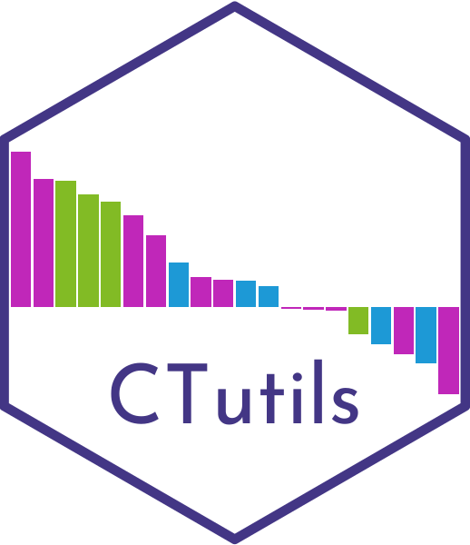
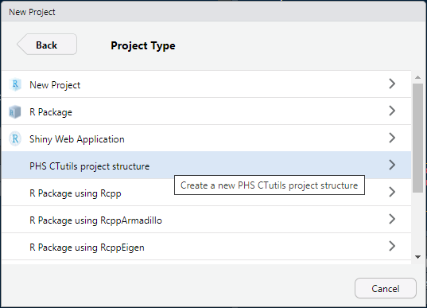
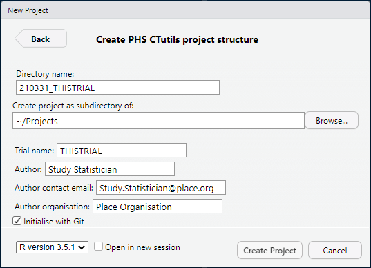
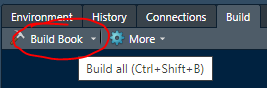
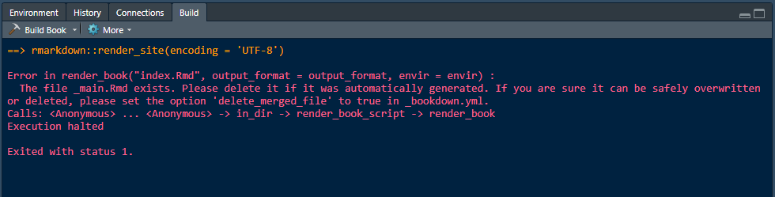

```{r setup, include = FALSE}
knitr::opts_chunk$set(
  collapse = TRUE,
  comment = "#>"
)
```

# CTutils Quickstart Guide

Welcome to the CTutils package (see-tee-yoo-tils).



This package is designed to get you up and running with clinical
trial documentation quickly.  Functionality includes:

- A project template (via the New Project > New Directory menu item)
- A system of specifying trial specific information, to be used throughout the document (settings.yml)
- Necessary files (.yml and index.Rmd files) to build a Bookdown document
- Blank .yml structures to create new document as required (coming soon...!)
- Utility functions to populate the document with the necessary analyses

This particular vignette is a quickstart guide that gives you an
overview of the process.  More information about the last point above
(the utility functions) is provided in the CTutils-functions vignette.

## Installation

The package can be installed via Github as shown below:

```
# library(remotes)
# remotes::install_github("LisaHopcroft/CTutils")
library(CTutils)
```

Please report bugs etc as issues on Github.

## New project template

Once the package is installed and loaded, a "PHS CTutils project
structure" option should appear in the File > New Project > New Directory
list.



You will be presented with a window, in which you can enter
relevant information about the trial (these can all be changed
later if necessary).



When you select "Create Project", a new skeleton directory structure
will be created, with some template Rmarkdown files that you can
populate with the necessary tables, figures, listings and analyses.

## `settings.yml`

All information describing the trial should be saved to the file
settings.yml. After setting up the project directory, this is the
first thing that you want to update.

NB. You can add to this .yml structure yourself and the necessary 
variable will be read in by `read_report_YAML()`. More information
about this in the extended vignette (under development).

## Adding additional documents

By default, the system allows the generation of two documents:

1. the main statistical study report
2. an accompanying summary document 

These are designed to meet the needs of closed and open sessions
of the Data Monitoring Committees respectively. Should you wish to
add another document, you will need to add a new document
specification file.  The document specification files for the two
default documents listed above are `_main.yml` and `_summary.yml`
respectively.

## Compiling 

You may have used the 'Build book' button in the Build pane to 
compile Bookdown documents before:



However, this won't work here - you will get an error that looks
like this:



You must instead use the `bookdown::render_book()` function with
appropriate parameters to compile the document.  A template
script (`DO.R`) has been provided that demonstrates how to do
this for the main and summary documents described in the
previous section.

## Notes

Be aware that to compile a statistical study report, you must:

1. Specify a data extract in `settings.yml`
2. Specify a MACRO DSD document in `settings.yml`

Hopefully this gives you an idea of how to get started. If you
feel any additional information should be added to this vignette,
please suggest it as an issue on the Github repo.

For more details information, please see the two other vignettes
for this package:

 - CTutils Functions
 - CTutils Detailed Documentation
 
